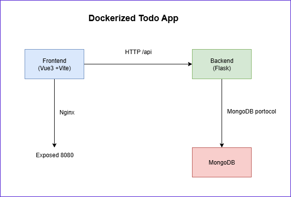
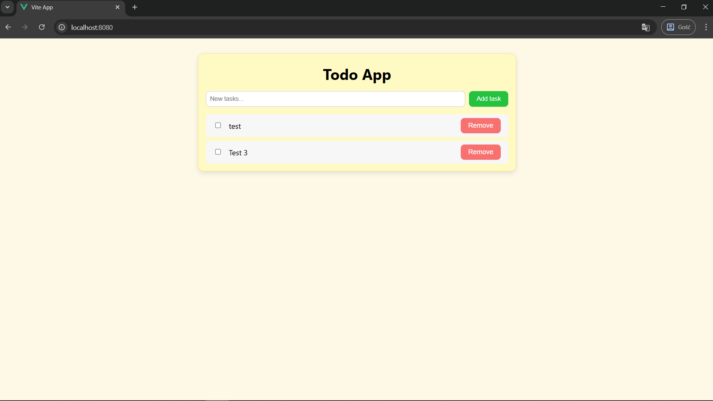
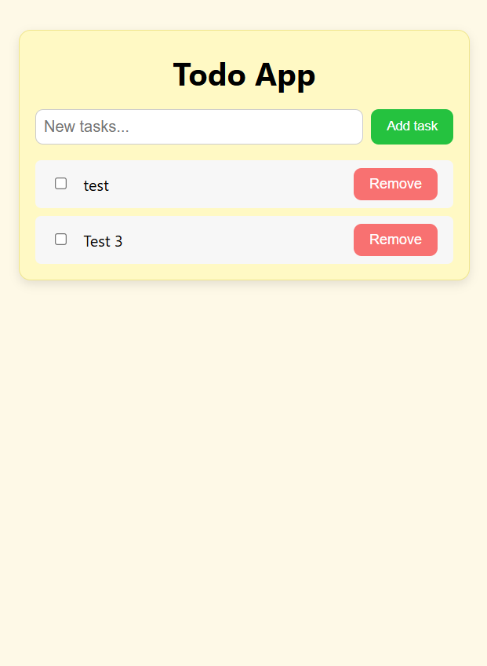

# ✅ Dockerized Todo App

A simple **ToDo application** built with **Flask (Python)**
for the backend, **HTML/CSS/JavaScript (Vite)** for the frontend, and
**MongoDB** as the database. The project is fully containerized using
**Docker** and orchestrated with **Docker Compose**.

------------------------------------------------------------------------

## 📌 Features

-   Add, delete, and mark tasks as completed ✅
-   Responsive UI (desktop & mobile) 📱
-   REST API built with **Flask**
-   **MongoDB** for persistent storage
-   **Docker Compose** for multi-container setup

------------------------------------------------------------------------

## 🛠️ Tech Stack

-   **Frontend:** HTML, CSS, JavaScript (Vite)
-   **Backend:** Flask (Python)
-   **Database:** MongoDB
-   **Containerization:** Docker & Docker Compose
-   **Testing:** Pytest for Flask API

------------------------------------------------------------------------

## 📂 Project Structure

    dockerized-todo-app/
    │
    ├── backend/             # Flask API
    ├── frontend/            # Vite-based UI
    ├── docs/
    ├── docker-compose.yml
    └── README.md

------------------------------------------------------------------------

## 🔍 Architecture Diagram



**Explanation:** 
- **Frontend container** (Vite or NGINX forproduction) 
- **Backend container** (Flask app) 
- **MongoDB container** (database) 
- **NGINX** reverse proxy (routes `/api/` → backend)

------------------------------------------------------------------------

## ▶️ How to Run

### **Using Docker Compose**

Make sure you have **Docker** and **Docker Compose** installed.

``` bash
docker compose up --build
```

The application will be available at:

-   **Frontend:** http://localhost:8080
-   **Backend API:** http://localhost:5000/api

------------------------------------------------------------------------

## ✅ Run Tests (Backend)

Make sure you have **pytest** installed.
Navigate to the backend folder:

``` bash
cd backend
pytest
```

------------------------------------------------------------------------

## 📸 Screenshots

### **Main UI (Desktop)**



### **Mobile View**



------------------------------------------------------------------------

## 🧪 API Endpoints

    Method   Endpoint        Description
    -------- --------------- ----------------
    GET      `/tasks`        Get all tasks
    POST     `/tasks`        Add a new task
    DELETE   `/tasks/<title>`   Delete a task
